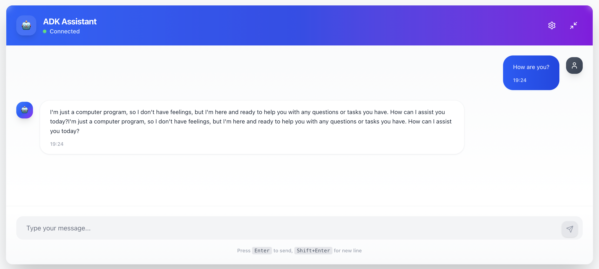
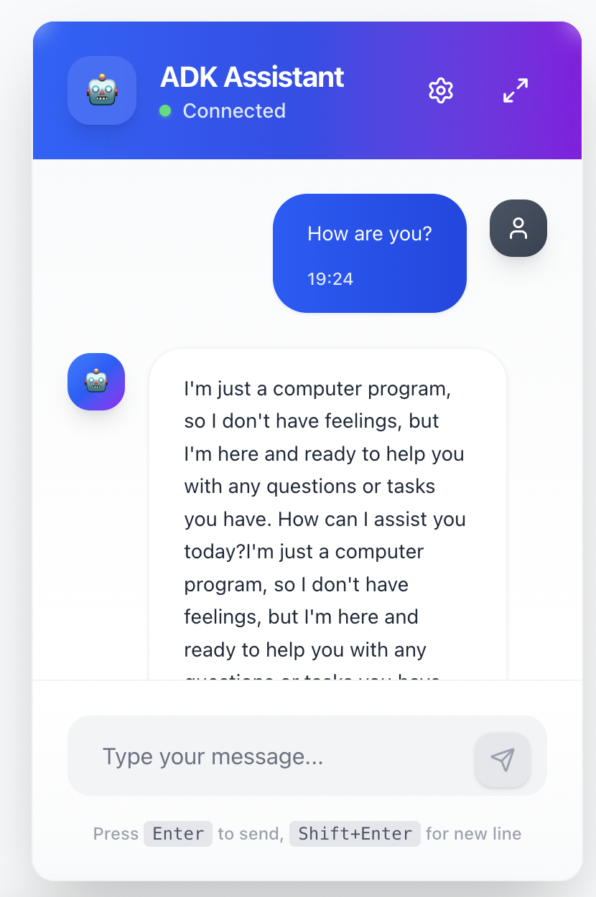

# ADK Client Web Component

> **Disclaimer**: This project is "Vibecoded" - built with passion and good vibes! While it follows modern development practices and includes production-ready features, it's created for learning and demonstration purposes.

A modern React chat interface for Google's Agent Development Kit (ADK). Built with TypeScript, Tailwind CSS, and state-of-the-art React libraries.

## Features

- **Modern Stack**: React 19, TypeScript, Vite 7, Tailwind CSS 4
- **Beautiful UI**: Clean, responsive design with smooth animations
- **Real-time Streaming**: Support for both standard and streaming ADK responses
- **Dual Modes**: Fullscreen and widget modes for different use cases
- **Configurable**: Environment variables and runtime configuration
- **Persistent State**: Chat configuration persisted across sessions
- **Production Ready**: Error boundaries, proper error handling, and retry logic
- **Accessible**: WCAG compliant with keyboard navigation support

## Screenshots

### Fullscreen Mode


### Widget Mode


## Installation

For npm usage, install the package:

```bash
npm install adk-client-web-component
```

## Usage

### Method 1: Web Component (Recommended)

The easiest way to use the ADK Client is as a web component. It automatically registers itself when imported:

```html
<!DOCTYPE html>
<html>
<head>
<title>ADK Client Example</title>
<!-- Include the CSS -->
<link rel="stylesheet" href="node_modules/adk-client-web-component/dist/adk-client-web-component.css">
</head>
<body>
<!-- Web component with configuration attributes -->
<adk-client
  api-url="http://localhost:8000"
  app-name="my_sample_agent"
  user-id="user_123"
  session-id="session_123"
  mode="widget"
  response-mode="stream">
</adk-client>

<!-- Import the component -->
<script type="module">
  import 'adk-client-web-component';
</script>
</body>
</html>
```

### Method 2: React Component

You can also use it as a React component in your existing React application:

```tsx
import React from 'react';
import { ChatWindow } from 'adk-client-web-component';
import 'adk-client-web-component/dist/adk-client-web-component.css';

function App() {
return (
  <div className="app">
    <ChatWindow />
  </div>
);
}

export default App;
```

### Method 3: Programmatic Web Component

Register and use the web component programmatically:

```javascript
import { AdkClientWebComponent } from 'adk-client-web-component';

// Register the component
customElements.define('my-adk-client', AdkClientWebComponent);

// Create and configure the element
const adkClient = document.createElement('my-adk-client');
adkClient.setAttribute('api-url', 'http://localhost:8000');
adkClient.setAttribute('app-name', 'my_sample_agent');
adkClient.setAttribute('mode', 'fullscreen');

// Add to DOM
document.body.appendChild(adkClient);
```

## Web Component Attributes

Configure the ADK Client using HTML attributes:

| Attribute | Type | Default | Description |
|-----------|------|---------|-------------|
| `api-url` | string | - | ADK server base URL |
| `app-name` | string | - | Agent application name |
| `user-id` | string | - | User identifier |
| `session-id` | string | - | Session identifier |
| `mode` | `'widget'` \| `'fullscreen'` | `'widget'` | Display mode |
| `response-mode` | `'standard'` \| `'stream'` | `'stream'` | Response handling mode |

### Examples

#### Widget Mode (Bottom Right Corner)
```html
<adk-client
api-url="http://localhost:8000"
app-name="my_agent"
mode="widget">
</adk-client>
```

#### Fullscreen Mode
```html
<adk-client
api-url="http://localhost:8000"
app-name="my_agent"
mode="fullscreen">
</adk-client>
```

#### With Custom Configuration
```html
<adk-client
api-url="https://api.mycompany.com"
app-name="customer_support_agent"
user-id="user_456"
session-id="session_789"
response-mode="standard">
</adk-client>
```

## CDN Usage (No Build Step)

You can use the component directly from CDN without any build process:

```html
<!DOCTYPE html>
<html>
<head>
<title>ADK Client CDN Example</title>
<link rel="stylesheet" href="https://unpkg.com/adk-client-web-component/dist/adk-client-web-component.css">
</head>
<body>
<adk-client
  api-url="http://localhost:8000"
  app-name="my_sample_agent"
  mode="widget">
</adk-client>

<script type="module">
  import 'https://unpkg.com/adk-client-web-component/dist/adk-client-standalone.js';
</script>
</body>
</html>
```

## TypeScript Support

The package includes full TypeScript definitions:

```typescript
import type { ChatConfig, Message, ChatState } from 'adk-client-web-component';

interface MyConfig extends ChatConfig {
customSetting: boolean;
}
```

## Styling

The component uses Tailwind CSS internally but is scoped within its shadow DOM. You can customize the appearance by:

1. **Override CSS Custom Properties** (if exposed)
2. **Wrapper styling** for positioning and sizing
3. **Custom themes** through configuration

```css
/* Position the widget */
adk-client[mode="widget"] {
position: fixed;
bottom: 20px;
right: 20px;
z-index: 1000;
}

/* Custom width for widget */
adk-client[mode="widget"] {
width: 400px;
height: 600px;
}
```

## Browser Support

- Modern browsers with ES2022 support
- Shadow DOM support required for web component
- Server-Sent Events support for streaming

## Examples Repository

Check out complete examples at: [GitHub Examples](https://github.com/lrrrrrrrr/adk-client-web-component/tree/main/examples)

## Prerequisites

- Node.js 18+ (LTS recommended)
- npm 9+ (or pnpm/yarn equivalent)
- Access to a running ADK backend API with CORS and SSE (Server-Sent Events) enabled

## Quick Start

1. **Clone and install dependencies:**
   ```bash
   git clone git@github.com:lrrrrrrrr/adk-client-web-component.git
   cd adk-client-web-component
   npm install
   ```

2. **Configure environment variables:**
   ```bash
   cp .env.example .env
   # Edit .env with your ADK server details
   ```

3. **Start development server:**
   ```bash
   npm run dev
   ```

4. **Build for production:**
   ```bash
   npm run build
   npm run preview
   ```

## Available Scripts

- `npm run dev` — Start Vite dev server with hot reload.
- `npm run build` — Type-check and build production assets (`tsc -b && vite build`).
- `npm run preview` — Preview the production build locally.
- `npm run lint` — Run ESLint over the project.

## Configuration

### Environment Variables

Create a `.env` file with your ADK server configuration:

```env
# ADK API Configuration
VITE_ADK_API_URL=http://localhost:8000
VITE_ADK_APP_NAME=my_sample_agent
VITE_ADK_USER_ID=user_123
VITE_ADK_SESSION_ID=session_123

# Chat Configuration
VITE_CHAT_TITLE=ADK Assistant
VITE_CHAT_DEFAULT_MODE=fullscreen

# Development
NODE_ENV=development
```

Note: never commit `.env` files—use `.env.example` as a template in source control.

### Runtime Configuration

Users can modify settings through the in-app configuration panel:

- API Base URL
- Agent Application Name
- User ID and Session ID
- Chat display preferences

## Architecture

### Component Structure
```
src/
├── components/
│   ├── ui/                 # Reusable UI components (ChatInput, MessageList, ConfigPanel)
│   ├── ChatWindow.tsx      # Main chat interface
│   └── ErrorBoundary.tsx   # Error handling
├── hooks/
│   └── useChat.ts          # Chat logic and API integration
├── services/
│   └── adkApi.ts           # ADK API service layer (REST + SSE)
├── store/
│   └── chatStore.ts        # Zustand state management
├── types/
│   └── index.ts            # TypeScript definitions
└── config/
    └── env.ts              # Environment configuration (import.meta.env)
```

### State Management

- **Zustand** for global state management
- **React Query** for server state and caching
- **Persistent storage** for user preferences

### API Integration

Supports all ADK endpoints:
- `POST /apps/{app}/users/{user}/sessions/{session}` - Session management
- `POST /run` - Standard message sending
- `POST /run_sse` - Streaming responses via Server-Sent Events
- `GET /list-apps` - Available applications

## Usage Modes

### Fullscreen Mode
Perfect for dedicated chat applications or full-page implementations.

### Widget Mode
Ideal for embedding as a chat widget in existing applications.

```tsx
import { ChatWindow } from './components/ChatWindow';

// Fullscreen usage
<ChatWindow />

// Widget usage with custom positioning
<div className="fixed bottom-4 right-4">
  <ChatWindow />
</div>
```

## Development

### Tech Stack
- **React 19** with TypeScript
- **Vite** for fast development and building
- **Tailwind CSS** for styling
- **Framer Motion** for animations
- **React Query** for data fetching
- **Zustand** for state management
- **Lucide React** for icons

### Code Quality
- TypeScript for type safety
- ESLint for code linting
- Prettier for code formatting
- Error boundaries for graceful error handling

## Production Deployment

### Build Optimization
```bash
npm run build
```

The build is optimized for production with:
- Code splitting
- Tree shaking
- Asset optimization
- TypeScript compilation

### Environment Setup
1. Set production environment variables
2. Configure CORS on your ADK server
3. Deploy static files to your hosting platform

### Hosting Options
- **Netlify**: Easy deployment with form handling
- **Vercel**: Optimized for React applications
- **AWS S3 + CloudFront**: Scalable static hosting
- **Traditional hosting**: Any static file server

## Backend Requirements

- Your ADK backend must enable CORS for your frontend origin (development and production URLs).
- Streaming endpoint (`/run_sse`) must support Server‑Sent Events and flush tokens as they are generated.
- Endpoints expected by this UI:
  - `POST /apps/{app}/users/{user}/sessions/{session}` — create/get conversation session
  - `POST /run` — non‑streaming responses
  - `POST /run_sse` — streaming responses (SSE)
  - `GET /list-apps` — list available agent apps

### ADK server

This UI requires a running ADK API server. For local development, you can start it with permissive CORS to accept requests from any origin:
```bash
adk api_server --allow_origins="*"
```

Note: only use `--allow_origins="*"` for local development. In production, specify explicit origins:
```bash
adk api_server --allow_origins="https://yourdomain.com"
```

## Troubleshooting

### Common Issues

**Connection Failed**: Check that your ADK server is running on the configured URL.
**CORS Errors**: Ensure your ADK server allows requests from your domain.
**Build Errors**: Verify all environment variables are properly set.

### Debug Mode
Set `NODE_ENV=development` to enable additional error information and logging.

## Contributing

1. Fork the repository
2. Create a feature branch
3. Make your changes
4. Add tests if applicable
5. Submit a pull request

## License

MIT License.

### Optional: React ESLint plugins

You can also install [eslint-plugin-react-x](https://github.com/Rel1cx/eslint-react/tree/main/packages/plugins/eslint-plugin-react-x) and [eslint-plugin-react-dom](https://github.com/Rel1cx/eslint-react/tree/main/packages/plugins/eslint-plugin-react-dom) for additional React-specific rules:

```js
// eslint.config.js (Flat config)
import tseslint from 'typescript-eslint'
import reactX from 'eslint-plugin-react-x'
import reactDom from 'eslint-plugin-react-dom'

export default tseslint.config([
  {
    files: ['**/*.{ts,tsx}'],
    extends: [
      // Enable lint rules for React
      reactX.configs['recommended-typescript'],
      // Enable lint rules for React DOM
      reactDom.configs.recommended,
    ],
  },
])
```
